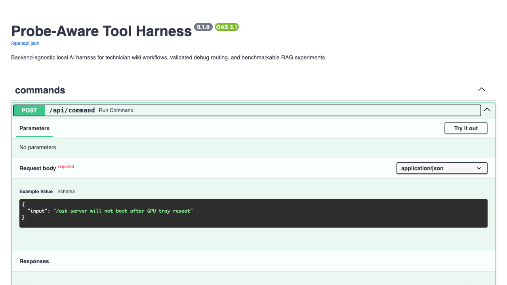
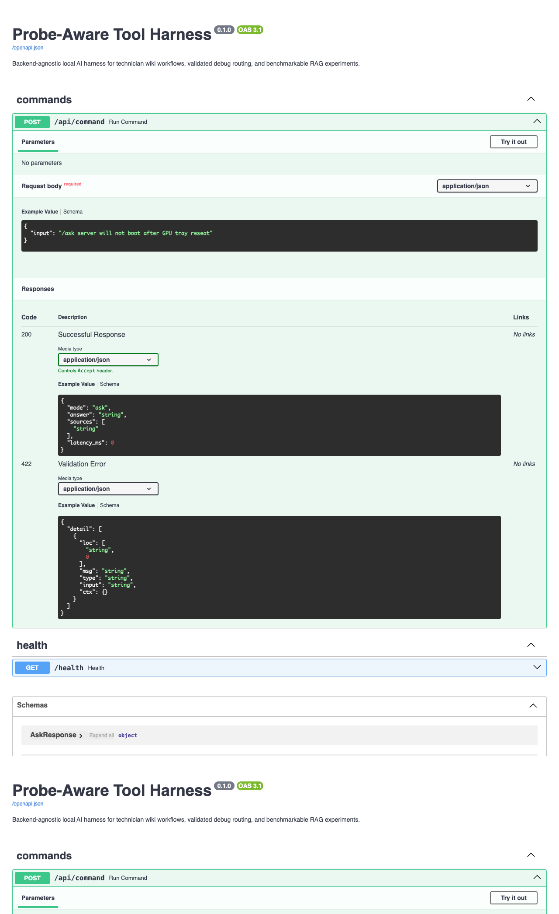

# API Examples

These examples were captured from a running local demo with:

```bash
MODEL_BACKEND=mock RESULTS_PATH=/tmp/probe-aware-api-results.csv \
  uvicorn app.main:app --host 127.0.0.1 --port 8765
```

## Health

```bash
curl -s http://127.0.0.1:8765/health
```

```json
{
  "status": "ok"
}
```

## Ask Mode

```bash
curl -s http://127.0.0.1:8765/api/command \
  -H 'Content-Type: application/json' \
  -d '{"input": "/ask GPU tray reseat boot failure"}' | python -m json.tool
```

```json
{
  "mode": "ask",
  "answer": "Check the GPU tray alignment first, then verify auxiliary GPU power leads and confirm the PSU LEDs are in a healthy state. If the system still fails to boot, compare BMC event entries against the reseat timestamp and stop before replacing parts unless the wiki context supports that step. Sources: gpu-tray-reseat, psu-led-status.",
  "sources": [
    "wiki://gpu-tray-reseat",
    "wiki://psu-led-status",
    "wiki://bmc-reset-procedure"
  ],
  "latency_ms": 1
}
```

## Debug Mode

```bash
curl -s http://127.0.0.1:8765/api/command \
  -H 'Content-Type: application/json' \
  -d '{"input": "/debug GPU tray reseat boot failure"}' | python -m json.tool
```

```json
{
  "mode": "debug",
  "url": "wiki://gpu-tray-reseat",
  "latency_ms": 1
}
```

## Screenshots




