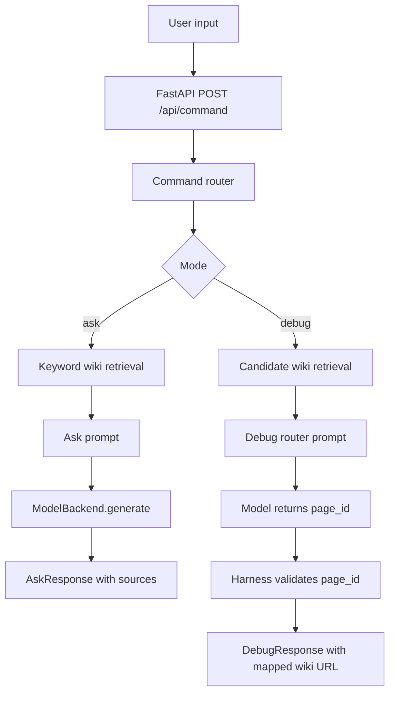
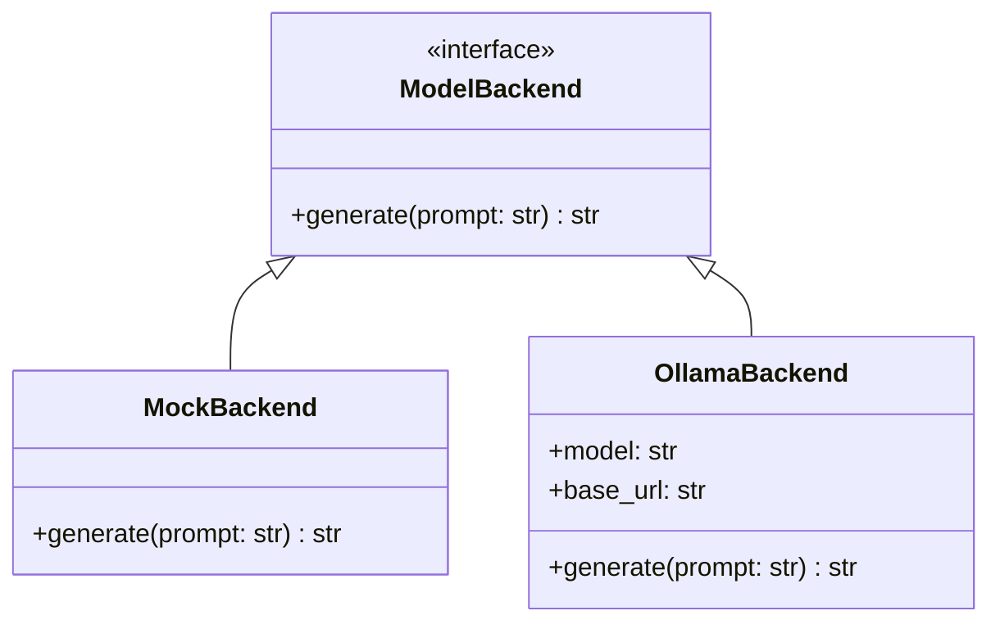

# Architecture

## Request Flow

## Boundaries

The app has four main layers:

- `app/`: FastAPI app and HTTP request handling.
- `harness/`: command parsing, prompt construction, response shaping, and benchmark logging.
- `backends/`: model runtime adapters.
- `retrieval/` and `mcp_servers/`: synthetic wiki access and search tools.

## URL Safety

The model does not create final debug URLs. It can only suggest a page ID. The harness validates that ID against known synthetic wiki pages and then maps it to `wiki://{page_id}`.

If the model output is invalid, the harness falls back to the highest-ranked keyword result rather than returning a hallucinated URL.

## Backend Abstraction

## Stable vs Experimental

Stable:

- FastAPI route
- command router
- keyword retrieval
- synthetic wiki docs
- mock and Ollama backends
- MCP-style wiki tools
- latency logging

Experimental:

- vector search replacement
- hidden-state probing
- probe-aware backend
- early tool-call exit benchmark comparison

