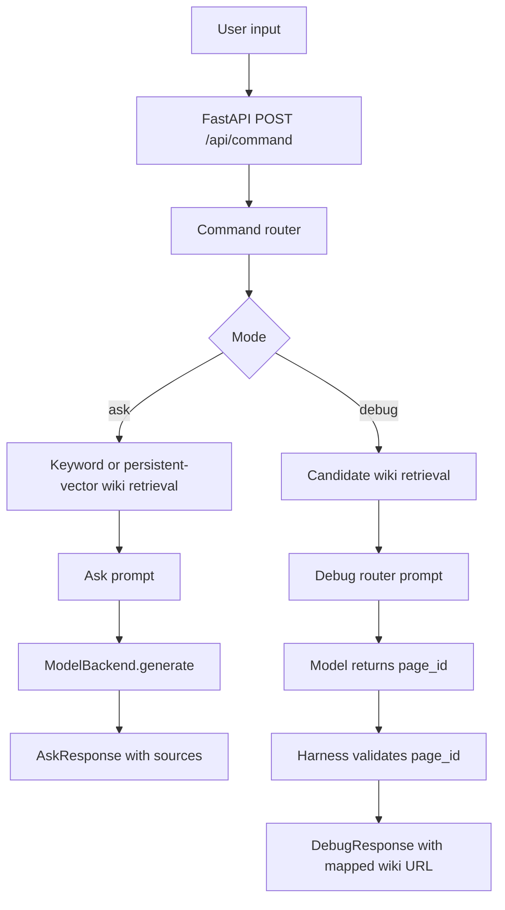
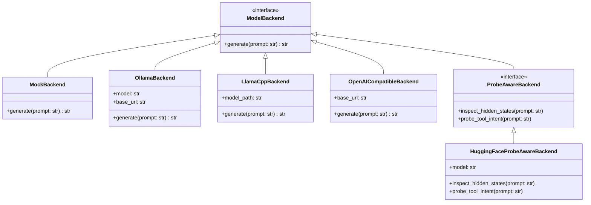

# Architecture

## Request Flow

## Boundaries

The app has four main layers:

- `app/`: FastAPI app and HTTP request handling.
- `harness/`: command parsing, prompt construction, response shaping, and benchmark logging.
- `backends/`: model runtime adapters.
- `retrieval/` and `mcp_servers/`: synthetic wiki access and search tools.

## URL Safety

The model does not create final debug URLs. It can only suggest a page ID. The harness validates that ID against known synthetic wiki pages and then maps it to `wiki://{page_id}`.

If the model output is invalid, the harness falls back to the highest-ranked keyword result rather than returning a hallucinated URL.

## Backend Abstraction

## Retrieval Abstraction

The harness expects the retrieval layer to provide `search`, `get_page`, `page_ids`, and `related_page_ids`.

- `KeywordWikiSearch` reparses markdown pages on startup.
- `PersistentVectorWikiSearch` stores token-count vectors in a JSON index and reloads them across benchmark runs.
- `ChromaWikiSearch` uses a real Chroma persistent vector database with a deterministic local hashing embedding function.

The persistent JSON index is deliberately simple and inspectable. The Chroma adapter exercises the real vector database boundary while staying optional through the `vector-db` extra.

## Stable vs Experimental

Stable:

- FastAPI route
- command router
- keyword retrieval
- persistent vector retrieval
- Chroma vector database retrieval
- synthetic wiki docs
- mock, Ollama, llama.cpp, and OpenAI-compatible backends
- MCP-style wiki tools
- latency logging
- repeated benchmark fixtures
- trained synthetic probe fixture and report

Experimental:

- hidden-state probing through `HuggingFaceProbeAwareBackend`
- early tool-call exit benchmark comparison
